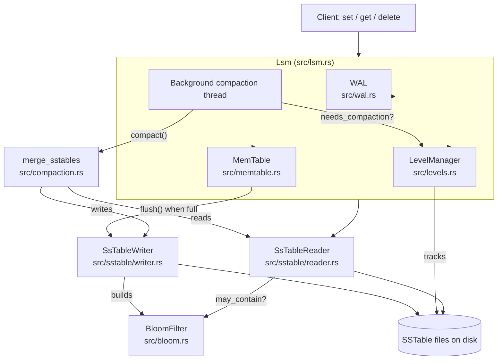
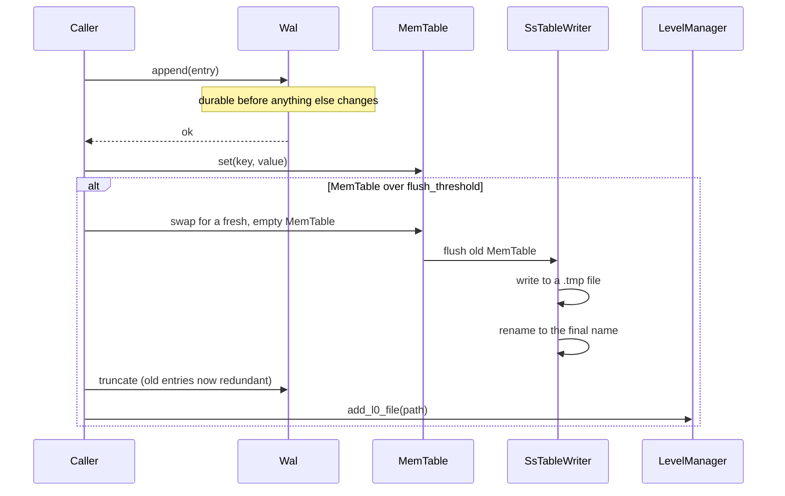
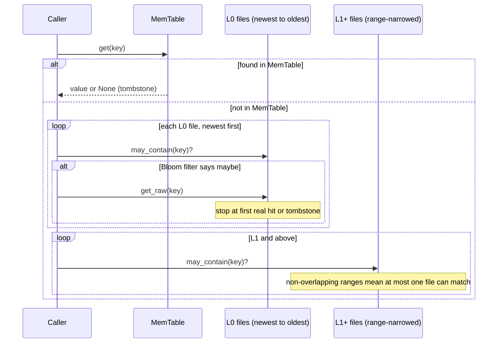
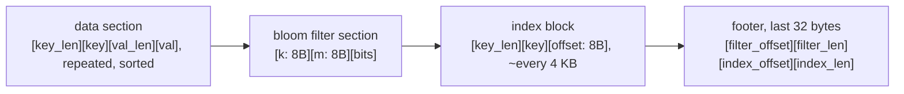

# Architecture

This document walks through Tabula from the ground up: the problem it solves, the decisions that got made along the way, and what each file in the codebase actually does. If `README.md` is the elevator pitch, this is the long version.

## The problem, before any code

Writing to disk in a random order is slow. Every write means finding the right spot on disk and updating it in place, and on spinning or flash storage that scattered access pattern is expensive compared to writing things one after another in a straight line.

An LSM tree (log-structured merge-tree) avoids that by changing the rule: never write to disk in place, ever. Instead, writes always go somewhere sequential, and old data only ever gets replaced by writing an entirely new file, never by editing an existing one. That trade shows up everywhere in this codebase: files that never change once written, a background process that cleans up after itself later, and a design that pays a little extra work down the line in exchange for writes that are cheap right now.

## Building it up, one decision at a time

### 1. Start with memory: the MemTable

Every database needs somewhere for a write to land immediately, and memory is the only place that's fast enough. Tabula's `MemTable` wraps a `BTreeMap<Vec<u8>, Vec<u8>>`. A `BTreeMap` keeps its keys sorted as an invariant of every insert, which matters later: when this table gets written to disk, the keys need to already be in order, and a `BTreeMap` gives that for free instead of needing a separate sort pass.

A delete doesn't remove a key from the map. It inserts a tombstone, a sentinel value, in its place. That decision looks unnecessary until you have more than one file on disk: if an older file still holds a real value for a key, the delete has to be recorded somewhere durable, or that old value could resurface later. The tombstone is that record.

### 2. Memory disappears on crash: the WAL

A `BTreeMap` living in a process's memory vanishes the instant that process dies. Before anything gets written to the MemTable, it gets appended to the write-ahead log first. If the process crashes before that data ever makes it into a file, replaying the log on restart rebuilds the MemTable exactly as it was.

Each WAL entry carries its own CRC32 checksum, covering the operation type, both length fields, and the key and value bytes. On replay, a checksum mismatch or a length that doesn't fit the remaining bytes means the entry got cut short or corrupted, and replay stops there instead of panicking or trusting bad data. Since the log is append-only, only the very last entry can plausibly be an interrupted write, so recovery just keeps everything that decoded cleanly and discards the rest.

### 3. Memory can't grow forever: flushing to an SSTable

Once the MemTable crosses a size threshold, it gets written out as a Sorted String Table (SSTable): an immutable file, written once, holding every key-value pair in sorted order. Immutable is the important word. Nothing ever edits an SSTable in place again. Compaction later replaces old SSTables with new ones, but it never modifies bytes inside an existing file.

Writing goes to a temporary file first, and only an atomic rename at the very end reveals it under its real name. A crash partway through a flush leaves an orphaned `.tmp` file that nothing ever looks at, instead of a broken file sitting exactly where a reader expects a complete one.

### 4. Reading a sorted file without loading it all: the sparse index

A sorted file on disk is only useful if you can find something in it without reading the whole thing. The writer places a checkpoint in a sparse index roughly every 4 KB of data written: a key and the byte offset where its record starts. A lookup binary-searches that small in-memory index (never the file itself), finds the checkpoint just before the target key, seeks there, and scans forward a short distance until it finds the key or proves it isn't there.

That scan is bounded by the index granularity, not by the size of the file. A bigger file doesn't mean a slower lookup; it just means the same few-kilobyte worst case scan, wherever in the file it happens to land.

### 5. Skipping files that can't have your key: the Bloom filter

As more SSTables accumulate, a single lookup might have to check several of them. Before opening a file and doing any real work, Tabula checks a Bloom filter built for that file: a bit array with no keys stored in it, where inserting a key flips a handful of bits chosen by hashing it several different ways (built from two hand-rolled hash functions, FNV-1a and djb2, combined through double hashing to simulate as many independent hash rounds as the false-positive-rate math calls for).

The filter can say "definitely not here" for free, skipping a disk seek entirely. It can only ever say "maybe" for a real hit, since two different keys can coincidentally set the same bits. False positives are possible. False negatives are not, because a bit only ever gets turned on, never off.

### 6. Files pile up forever: compaction and levels

Every flush creates a new SSTable, and nothing so far removes old ones. Left alone, reads would eventually have to check every file ever written, and old, overwritten, or deleted data would sit on disk forever.

Fresh files land in level 0 (L0), where their key ranges can overlap, since each one arrives from an independent flush with no coordination between them. Once L0 collects four files, compaction kicks in: a k-way merge (a min-heap of one candidate record per input file) walks all of them in sorted order at once, keeping only the newest value for any key that appears more than once, and dropping tombstones once nothing older is left that they could still be protecting. The merge only pulls in L1 files whose key range actually overlaps L0's, leaving the rest of L1 untouched. L1 and every level above it are kept non-overlapping by construction, so a read only ever has to check one candidate file per level instead of every file that exists.

A background thread wakes every 200 milliseconds, checks whether L0 needs compacting, and runs it without anything else having to ask.

### 7. One database, many threads: the Lsm engine

Everything above gets tied together by the `Lsm` struct, and this is where concurrency has to be dealt with honestly. The MemTable and the level list both sit behind a `RwLock`, not a `Mutex`, because a plain mutex would force every read to queue behind a single lock even when nothing is being written, and reads check the MemTable on every single call. A `RwLock` lets any number of readers through together and only blocks them while a write is actually happening.

The WAL sits behind a plain `Mutex`, since writes to it are always exclusive anyway. During a flush, that lock is held for the entire operation, not just the instant the MemTable gets swapped out, because releasing it early would let another thread's write land in the WAL in the exact window where a crash could wipe it out before it was ever included in that flush.

### 8. You can't improve what you don't measure: benchmarking

Once the engine worked, the next question was how fast, and guessing doesn't answer that. Criterion benchmarks cover `set`, `get`, and a full MemTable flush, and a flamegraph of the flush path pointed at real hotspots instead of assumed ones. Two optimizations came out of that: batching `SsTableWriter::add`'s four small writes into one (which turned out not to matter, since `BufWriter` was already coalescing them) and enlarging that `BufWriter`'s buffer so a whole flush fits in one real syscall instead of several (which measured a genuine ~9% improvement). The lesson mattered as much as the numbers: a profiler that samples on-CPU time can miss the actual bottleneck if it's time spent blocked on disk I/O rather than time spent computing.

### 9. The last mile: crash recovery

Crash recovery isn't one feature, it's the sum of a lot of small honesty checks made everywhere else: the WAL's checksums and bounds-checked decoding, replay stopping cleanly at a corrupted tail instead of refusing to start, SSTables writing to a temp file and only appearing atomically, and a `sync` flag on WAL appends for the rare case where losing the last few unflushed writes on a power failure is worse than the throughput cost of fsyncing every single one (roughly 2,850x slower in this codebase's own measurements, which is exactly why it's a choice and not the default).

## How the pieces connect

## The write path

## The read path

## The SSTable file layout

A reader always starts at the end: seek to `file_size - 32`, read the footer, and that tells you exactly where the Bloom filter and the index live, without ever having to scan the file to find them.

## File by file

| File | What it holds |
|---|---|
| `src/memtable.rs` | The in-memory sorted table every write hits first. Tombstones, range scans, and the `flush` that turns it into an SSTable. |
| `src/wal.rs` | `WalEntry` encode/decode with CRC32 checksums, and `Wal` itself: append, truncate, and replay. |
| `src/types.rs` | The tombstone sentinel and the `is_tombstone` check shared across the codebase. |
| `src/sstable/writer.rs` | `SsTableWriter`: builds the data section, Bloom filter, index, and footer, and writes through a temp file with an atomic rename on success. |
| `src/sstable/reader.rs` | `SsTableReader`: parses the footer and index on open, binary-searches for point lookups, and exposes a lazy full-scan iterator. |
| `src/bloom.rs` | `BloomFilter`: hand-rolled FNV-1a and djb2 hashing, `insert`, `may_contain`, and byte serialization so it can live inside an SSTable file. |
| `src/compaction.rs` | The k-way merge that does the actual work of compaction: a min-heap over every input file's next record, keeping the newest value and dropping tombstones. |
| `src/levels.rs` | `LevelManager`: tracks which files belong to which level, decides when L0 needs compacting, and figures out which L1 files actually overlap before merging. |
| `src/lsm.rs` | The `Lsm` engine that ties everything together: locking, the background compaction thread, and startup recovery (`discover_levels`, WAL replay). |
| `src/lib.rs` | Declares the module tree so both the binary and the benchmarks can use the same code. |
| `src/main.rs` | A small smoke test you can run directly with `cargo run`. |
| `src/bin/profile_flush.rs` | A standalone loop for flamegraphing `MemTable::flush` in isolation, without criterion's own overhead in the profile. |
| `benches/lsm_bench.rs` | Criterion benchmarks for `set`, `get`, flush, and WAL sync, with recorded baseline numbers and the reasoning behind each optimization attempt. |
